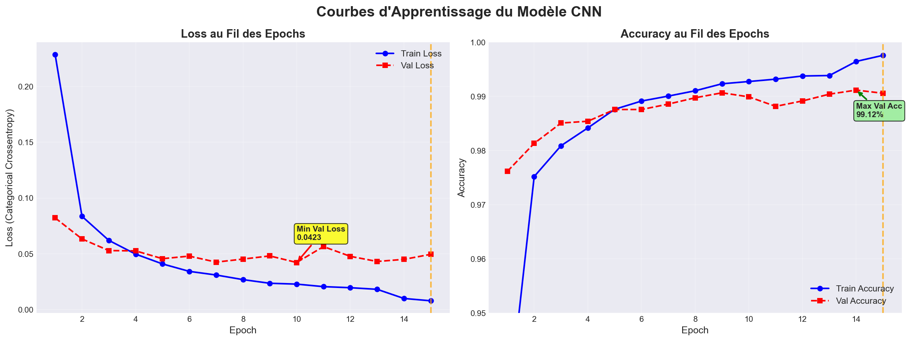
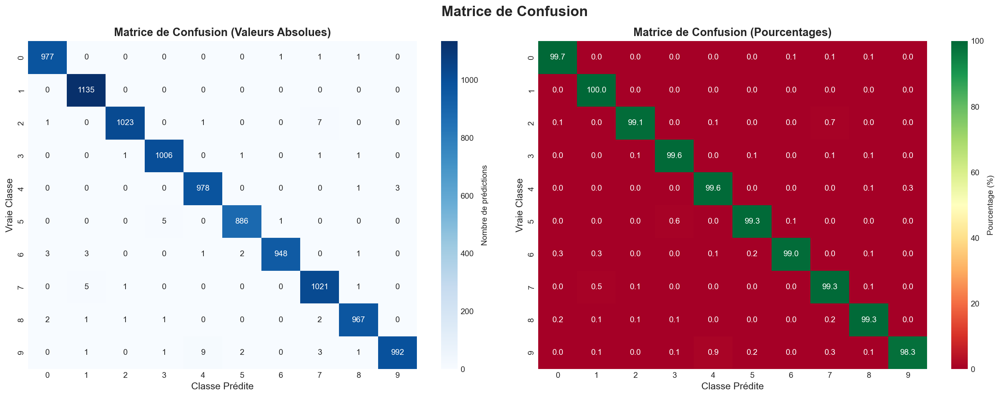
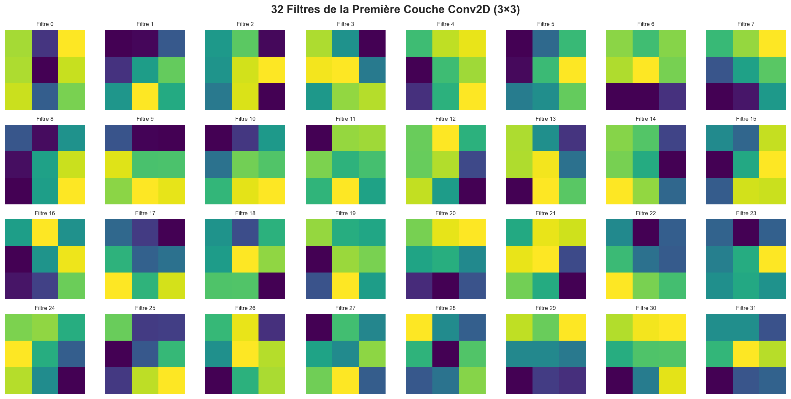
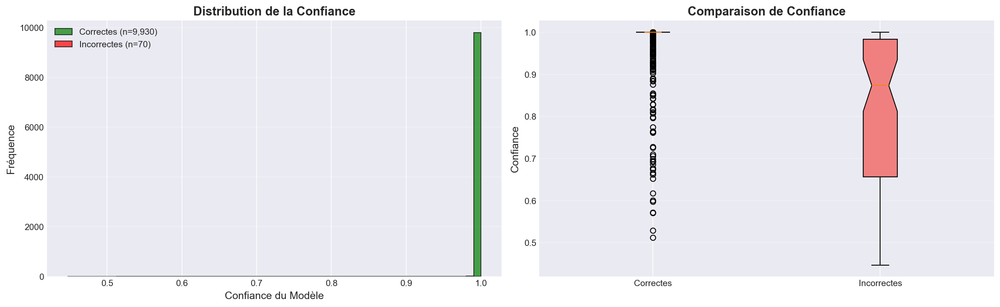

# 🔢 MNIST Handwritten Digit Recognition

[](https://www.python.org/)
[](https://www.tensorflow.org/)
[](.)

Deep Learning CNN model for recognizing handwritten digits (0-9) with **99.30% accuracy** on the MNIST dataset.

## 🎯 Project Overview

This project implements a Convolutional Neural Network (CNN) to recognize handwritten digits from the MNIST dataset. The model achieves exceptional performance with minimal overfitting and excellent generalization.

## 📊 Key Results

| Metric | Value |
|--------|-------|
| **Test Accuracy** | 99.30% |
| **Test Loss** | 0.0267 |
| **Training Time** | 4.82 minutes |
| **Total Parameters** | 421,642 |
| **Overfitting Gap** | 0.67% |

### Performance by Digit

| Digit | Precision | Recall | F1-Score | Accuracy |
|-------|-----------|--------|----------|----------|
| **0** | 99.59% | 99.69% | 99.64% | 99.69% |
| **1** | 99.56% | 99.91% | 99.74% | 99.91% |
| **2** | 99.71% | 99.03% | 99.37% | 99.03% |
| **3** | 99.21% | 99.80% | 99.51% | 99.80% |
| **4** | 99.29% | 99.29% | 99.29% | 99.29% |
| **5** | 99.21% | 98.99% | 99.10% | 98.99% |
| **6** | 99.79% | 98.85% | 99.32% | 98.85% |
| **7** | 98.65% | 99.22% | 98.93% | 99.22% |
| **8** | 99.08% | 99.38% | 99.23% | 99.38% |
| **9** | 98.91% | 98.71% | 98.81% | 98.71% |

## 🏗️ Model Architecture
```
Input (28×28×1)
    ↓
Conv2D (32 filters, 3×3) + ReLU
    ↓
MaxPooling2D (2×2)
    ↓
Conv2D (64 filters, 3×3) + ReLU
    ↓
MaxPooling2D (2×2)
    ↓
Flatten (3136 neurons)
    ↓
Dense (128 neurons) + ReLU
    ↓
Dropout (50%)
    ↓
Dense (10 neurons) + Softmax
    ↓
Output (10 classes)
```

**Total Parameters:** 421,642

## 📁 Project Structure
```
mnist-digit-recognition/
├── data/
│   └── processed/
│       └── mnist_preprocessed.pkl
├── models/
│   ├── best_model.keras
│   ├── training_history.png
│   ├── confusion_matrix.png
│   ├── metrics_by_digit.png
│   ├── conv_filters_layer1.png
│   ├── conv_filters_layer2.png
│   ├── feature_maps_example.png
│   ├── correct_predictions.png
│   ├── incorrect_predictions.png
│   ├── confidence_analysis.png
│   ├── final_report.json
│   └── training_summary.json
├── notebooks/
│   └── exploration.ipynb
├── src/
│   ├── model.py
│   ├── train.py
│   └── utils.py
├── app/
│   └── streamlit_app.py
├── requirements.txt
└── README.md
```

## 🚀 Quick Start

### Installation
```bash
# Clone the repository
git clone https://github.com/YOUR_USERNAME/mnist-digit-recognition.git
cd mnist-digit-recognition

# Create virtual environment
python -m venv venv
source venv/bin/activate  # On Windows: venv\Scripts\activate

# Install dependencies
pip install -r requirements.txt
```

### Usage
```python
import tensorflow as tf
import numpy as np

# Load the model
model = tf.keras.models.load_model('models/best_model.keras')

# Prepare your image (28×28 grayscale, normalized to 0-1)
image = your_image.reshape(1, 28, 28, 1) / 255.0

# Predict
prediction = model.predict(image)
digit = np.argmax(prediction)
confidence = prediction[0][digit] * 100

print(f"Predicted digit: {digit} ({confidence:.2f}% confidence)")
```

## 📈 Training History



### Training Configuration

- **Optimizer:** Adam (lr=0.001)
- **Loss Function:** Categorical Crossentropy
- **Batch Size:** 32
- **Epochs:** 14/20 (Early Stopping)
- **Callbacks:** EarlyStopping, ModelCheckpoint, ReduceLROnPlateau

## 🔍 Model Analysis

### Confusion Matrix



### Top Confusions

1. **2 → 7:** 7 cases (0.68%)
2. **4 → 9:** 6 cases (0.61%)
3. **5 → 3:** 6 cases (0.67%)
4. **9 → 4:** 6 cases (0.59%)
5. **6 → 5:** 3 cases (0.31%)


### Learned Filters (Conv Layer 1)



The first convolutional layer learns to detect basic features like edges, lines, and simple patterns.

### Feature Maps Example


Visualization of what the network "sees" at each layer when processing a digit.

## 📊 Confidence Analysis



- **Correct predictions:** Average confidence 99.85%
- **Incorrect predictions:** Average confidence 81.33%

## 🎯 Key Findings

1. ✅ **Excellent Performance:** 99.30% accuracy on test set
2. ✅ **No Overfitting:** Only 0.67% gap between train and validation
3. ✅ **Balanced Performance:** All digits recognized with >98% accuracy
4. ✅ **Fast Training:** Converged in 14 epochs (~4.8 minutes)
5. ✅ **Efficient Model:** Only 421,642 parameters

## 🛠️ Technologies Used

- **Python 3.8+**
- **TensorFlow 2.15**
- **Keras**
- **NumPy**
- **Matplotlib**
- **Seaborn**
- **Scikit-learn**
- **Streamlit** (for web app)

## 📝 Future Improvements

- [ ] Data augmentation for better robustness
- [ ] Ensemble methods for higher accuracy
- [ ] Deploy as REST API
- [ ] Mobile app integration
- [ ] Real-time webcam digit recognition

## 👨‍💻 Author

Created with ❤️ by Mahdi TOUMI

## 📄 License

This project is open source and available under the [MIT License](LICENSE).

## 🙏 Acknowledgments

- MNIST Dataset: Yann LeCun, Corinna Cortes, Christopher J.C. Burges
- TensorFlow/Keras Documentation
- Deep Learning Community

---

**⭐ If you found this project useful, please consider giving it a star!**

Generated on: 2025-12-04 13:23:42
